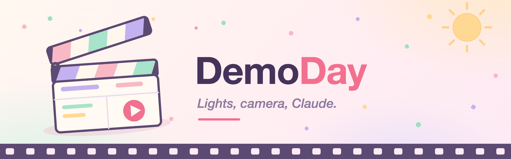

# DemoDay

**Your software deserves a launch video. Let Claude film it.**

DemoDay is a [Claude Code](https://claude.com/claude-code) plugin that turns any
codebase into a finished, narrated demo video. Claude reads your repo, writes the
script with you, **drives your app on screen**, narrates it with an AI voiceover —
and hands you a polished MP4 with intro, captions, transitions and an optional
on-camera presenter. One command, about the cost of a coffee.

```
/demoday:create-demo-video
```

## 🎬 See it in action

<!-- TODO(Mark): embed the sample videos here. Edit README.md on github.com and
     drag each .mp4 into the editor — GitHub uploads it and inserts a
     user-attachments URL that renders as an inline player. Committed .mp4 files
     do NOT get a player, so the drag-drop upload is the way. -->

*Sample videos coming right after launch — the first one was filmed, narrated and
edited entirely by DemoDay, including the sea-captain voiceover.*

## ✨ What you get

- 🖱️ **Claude drives your app** — it rehearses off camera first, then a
  deterministic runner performs the take with smooth cursor moves and human
  typing. No dead air, no fumbling.
- 🎙️ **AI voiceover with word-timed captions** — narration is generated first,
  so every scene lands exactly on the voice.
- 🧑‍💼 **Optional on-camera presenter** — an AI presenter for the intro, outro
  and cutaways, lip-synced to the same voice as the narration.
- 🗣️ **Custom character voices** — describe a voice in plain English
  (*"weathered lobster-boat captain, thick coastal accent"*) and the whole demo
  is narrated in it.
- 🎞️ **Real editing, not a screencast** — title cards, transitions,
  zoom-to-click, callouts, b-roll and audio ducking, rendered with
  [Remotion](https://remotion.dev).
- 💻 **Films almost anything on a Mac** — web apps, native macOS apps, and
  CLI/terminal programs (yes, it can demo a Claude Code plugin from inside a
  live `claude` session).
- 🔁 **Cheap to iterate** — change one line of narration and only that line is
  regenerated. A cost estimate is shown *before* anything is spent.

## 🚀 Install

In Claude Code:

```
/plugin marketplace add mrieck/claude-plugins
/plugin install demoday@productive-mark
```

That's it for software — no `npm install`, no manual dependency setup. The first
time you run `/demoday:create-demo-video`, Claude checks your machine and
installs anything missing (Node packages, a capture browser, ffmpeg) before
filming starts.

> **Requirements:** macOS and [Claude Code](https://claude.com/claude-code). The
> only thing Claude can't do for you is the two steps below.

### 1. Add your fal.ai key (required)

All generation — voice, presenter, b-roll — runs through
[fal.ai](https://fal.ai/dashboard/keys). Store the key in your macOS Keychain by
running this **in your own terminal** (not through Claude, so the key never
touches a transcript):

```bash
security add-generic-password -s demoday -a FAL_API_KEY -w
```

It prompts for the key without echoing it. A typical 30-second demo costs
**$1–2 in fal credits**.

Not on Keychain terms? Every other place a key can live is covered in
[HOW_IT_WORKS.md](HOW_IT_WORKS.md#where-api-keys-can-live).

### 2. Grant screen permissions (desktop capture only)

To film a **native Mac app**, give the terminal you run Claude Code from
(Terminal, iTerm, VS Code…) **Screen Recording** and **Accessibility** in System
Settings → Privacy & Security, then restart the terminal. Filming web apps and
CLI demos in a staged terminal window needs no permissions at all — and if
anything's missing, Claude tells you the exact Settings pane during preflight.

### Optional keys

Same Keychain one-liner, different account name:

- **`ELEVENLABS_API_KEY`** — unlocks custom character voices via
  [ElevenLabs Voice Design](https://elevenlabs.io/pricing)<!-- TODO(Mark): swap in affiliate URL -->.
  Needs a paid ElevenLabs plan (Starter and up): the free tier blocks voice
  creation over the API, and a paid plan also carries the commercial license
  you'd want for a published video anyway.
- **`BRAVE_API_KEY`** — lets b-roll generation search reference images.

## 🎥 Make your first video

From the repo of the software you want to show off:

```
/demoday:create-demo-video
```

Claude will read the codebase, pitch you two or three flows worth filming, ask
about goal, audience, length and presenter style, and show you the cost estimate.
Only after you say yes does it generate a single frame. Ten-ish minutes later
there's an MP4 in `demo/`.

## 🔍 Under the hood

The interesting bits — the two-pass rehearse/perform design, narration-first
pacing, the `demo.json` manifest, content-addressed caching, and everything about
API-key resolution — live in [HOW_IT_WORKS.md](HOW_IT_WORKS.md).

## 📄 License notes

Rendering uses Remotion, which is free for individuals and small companies but
needs a paid license above a headcount threshold — see
[remotion.dev/license](https://remotion.dev/license). Voices generated on a paid
ElevenLabs plan include commercial usage rights.
